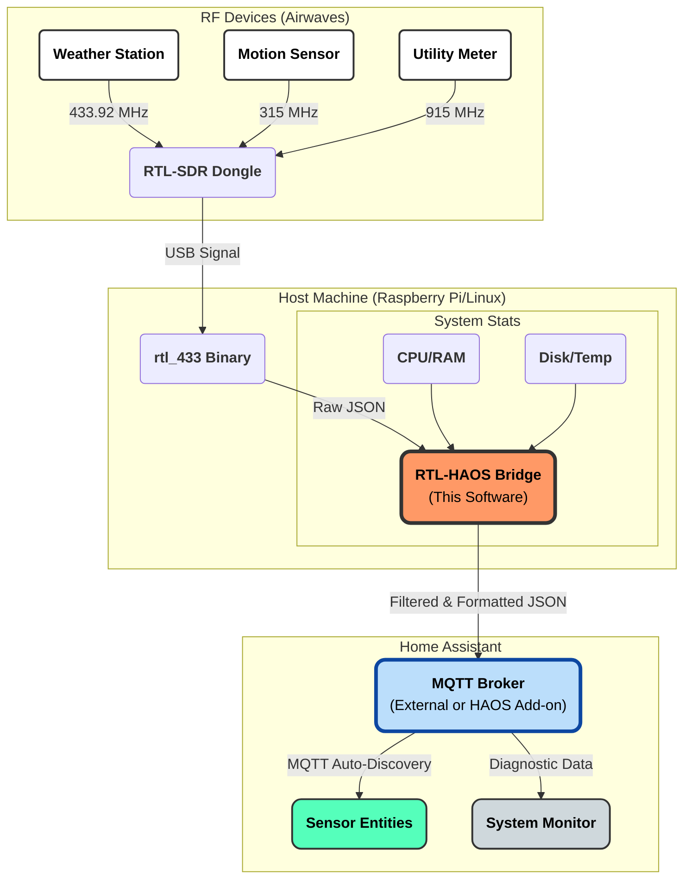

# RTL-HAOS: RTL-433 to Home Assistant Bridge


A "drop-in" bridge that turns one or more **RTL-SDR dongles** into Home Assistant-friendly sensors via MQTT. 

Unlike standard `rtl_433` scripts, this project captures **detailed signal metrics** (RSSI, SNR, Noise) for every received packet, allowing you to troubleshoot interference and optimize antenna placement directly from Home Assistant. 

It also functions as a **System Monitor**, reporting the host machine's health (CPU, RAM, Disk, Temp) and the live status of the radio dongle itself, giving you a complete view of your hardware's performance in one place.

---

## ✨ Features

* **Zero-Config Discovery:** Sensors appear automatically in Home Assistant (via MQTT Discovery) with correct units, icons, and friendly names.
* **Signal Diagnostics:** Reports **RSSI, SNR, and Noise Floor** for every device, making it easy to identify weak signals, plot coverage ranges, or hunt down interference sources.
* **Smart System Monitor:**
    * Reports Host CPU, RAM, Disk, and Temperature.
    * **Live Radio Status:** Shows `"Scanning..."`, `"Online"`, or error states like `"No Device Found"` / `"Error: USB Busy"` for each radio, grouped with the host device.
* **Native Graphing:** Environmental sensors use the correct `measurement` state class, and meter-like fields use `total_increasing`, so graphs and statistics in Home Assistant just work for temperatures, humidity, pressure, light, and utility counters.
* **Noise Reduction:**
    * **Data Averaging:** Buffers readings (e.g., every 30s) to prevent database bloat from sensors that spam updates every second.
    * **Filtering:** Built-in Whitelist and Blacklist support to ignore your neighbor's tire pressure sensors.
* **Advanced Data:**
    * **Dew Point:** Automatically calculated from Temp + Humidity sensors.
    * **Multi-Radio Support:** Run multiple dongles on different frequencies simultaneously.

---

## 🧩 How It Works



---

## 📸 Screenshots

| Device View | System Monitor |
|:---:|:---:|
|  |  |

| Efficacy Diagnosis Using Historical Gas Meter and Room Temperature Data |
|:---:|
|  |

---
## 📂 Project Layout

* `rtl_mqtt_bridge.py` – Main script. Starts rtl_433 processes, system monitor, and MQTT publishing.
* `config.example.py` – Template for your settings. Copy this to `config.py`.
* `config.py` – Your settings (radios, filters, MQTT, throttle).


---

## 🛠️ Hardware Requirements

* **Host:** Raspberry Pi (3/4/5), Mini PC, Proxmox, or any Linux machine.
* **Radio:** RTL-SDR USB Dongle (RTL-SDR Blog V3, Nooelec, etc.).

---

## 🚀 Installation

### 1. System Dependencies
Install Python and the `rtl_433` binary.

```bash
# Debian / Ubuntu / Raspberry Pi OS
sudo apt update
sudo apt install -y rtl-sdr rtl-433 git python3 python3-pip python3-venv
```

> **⚠️ Important:** Ensure your user has permission to access the USB stick!
> If you haven't already, install the rtl-sdr udev rules:
> `sudo apt install rtl-sdr` (or download the rules manually). Unplug and replug your dongle after installing.

### 2. Clone & Setup
```bash
git clone https://github.com/jaronmcd/rtl-haos.git
cd rtl-haos

# Create and activate virtual environment
python3 -m venv venv
source venv/bin/activate

# Install Python requirements
pip3 install -r requirements.txt
```

### 3. Configuration
Copy the example config and edit it.

```bash
cp config.example.py config.py
nano config.py
```

If you only have **one** RTL-SDR, you can leave `RTL_CONFIG = []` in `config.py`.  
The bridge will automatically try to read the dongle's serial with `rtl_eeprom` and use that.  
If it cannot detect a serial, it falls back to device index `id = "0"`.

**Key Configuration Examples:**

```python
# --- MQTT ---
MQTT_SETTINGS = {
    "host": "192.168.1.100",   # Your MQTT broker / Home Assistant IP
    "port": 1883,
    "user": "mqtt_user",
    "pass": "password",
    "keepalive": 60,
}

# --- MULTI-RADIO SETUP ---
# You can define multiple radios here; `id` should match the dongle serial (see Advanced: Multi-Radio Setup).
RTL_CONFIG = [
    {"name": "Weather Radio", "id": "101", "freq": "433.92M", "rate": "250k"},
    {"name": "Utility Meter", "id": "102", "freq": "915M",    "rate": "250k"},
]

# --- FILTERING ---
# Ignore specific neighbors by ID or Model
DEVICE_BLACKLIST = [
    "SimpliSafe*",
    "EezTire*",
]
```

---

## ▶️ Usage

Run the bridge manually to test connection:

```bash
source venv/bin/activate
python3 rtl_mqtt_bridge.py
```

**Expected Output:**
```text
[STARTUP] Connecting to MQTT Broker at 192.168.1.100...
[MQTT] Connected Successfully.
[RTL] Manager started for Weather Radio. Monitoring...
 -> TX RaspberryPi (b827eb...) [radio_status_0]: Scanning...
 -> TX RaspberryPi (b827eb...) [radio_status_0]: Online
 -> TX Acurite-5n1 (1234) [temperature]: 72.3
```

---

## 🔧 Advanced: Multi-Radio Setup (Critical)

If you plan to use multiple RTL-SDR dongles (e.g., one for 433MHz and one for 915MHz), you **must** assign them unique serial numbers. By default, most dongles share the serial `00000001`, which causes conflicts where the system swaps "Radio A" and "Radio B" after a reboot.

### ⚠️ Step 1: Safety First (Backup EEPROM)
Before modifying your hardware, it is good practice to dump the current EEPROM image. This allows you to restore the dongle if something goes wrong.

1.  Stop any running services (e.g., `sudo systemctl stop rtl-bridge`).
2.  Plug in **ONE** dongle.
3.  Run the backup command:
    ```bash
    rtl_eeprom -r original_backup.bin
    ```
    *This saves a binary file `original_backup.bin` to your current folder.*

### Step 2: Set New Serial Number
1.  With only one dongle plugged in, run:
    ```bash
    rtl_eeprom -s 101
    ```
    *(Replace `101` with your desired ID, e.g., 102, 103).*
2.  **Unplug and Replug** the dongle to apply the change.
3.  Verify the new serial:
    ```bash
    rtl_test
    # Output should show: SN: 101
    ```
4.  Repeat for your other dongles (one at a time).

> **Restoration:** If you ever need to restore the backup, use: `rtl_eeprom -w original_backup.bin`

## 🤖 Running as a Service

To keep the bridge running 24/7, use `systemd`.

1.  **Create the service file:**
    ```bash
    sudo nano /etc/systemd/system/rtl-bridge.service
    ```

2.  **Paste the configuration** (Update paths to match your username!):
    ```ini
    [Unit]
    Description=RTL-HAOS MQTT Bridge
    After=network.target

    [Service]
    Type=simple
    User=pi
    # UPDATE THIS PATH
    WorkingDirectory=/home/pi/rtl-haos
    # UPDATE THIS PATH (use python or python3 depending on your venv)
    ExecStart=/home/pi/rtl-haos/venv/bin/python3 /home/pi/rtl-haos/rtl_mqtt_bridge.py
    Restart=always
    RestartSec=10

    [Install]
    WantedBy=multi-user.target
    ```

3.  **Enable and Start:**
    ```bash
    sudo systemctl daemon-reload
    sudo systemctl enable rtl-bridge.service
    sudo systemctl start rtl-bridge.service
    ```

---

## ❓ Troubleshooting

* **"No Device Found" in Logs:**
    * The script cannot see your USB stick. 
    * Run `lsusb` to verify it is plugged in.
    * Ensure you are not running another instance of `rtl_433` in the background.
* **"Kernel driver is active" Error:**
    * Linux loaded the default TV tuner driver. You need to blacklist it.
    * Run: `echo "blacklist dvb_usb_rtl28xxu" | sudo tee /etc/modprobe.d/blacklist-rtl.conf` and reboot.
