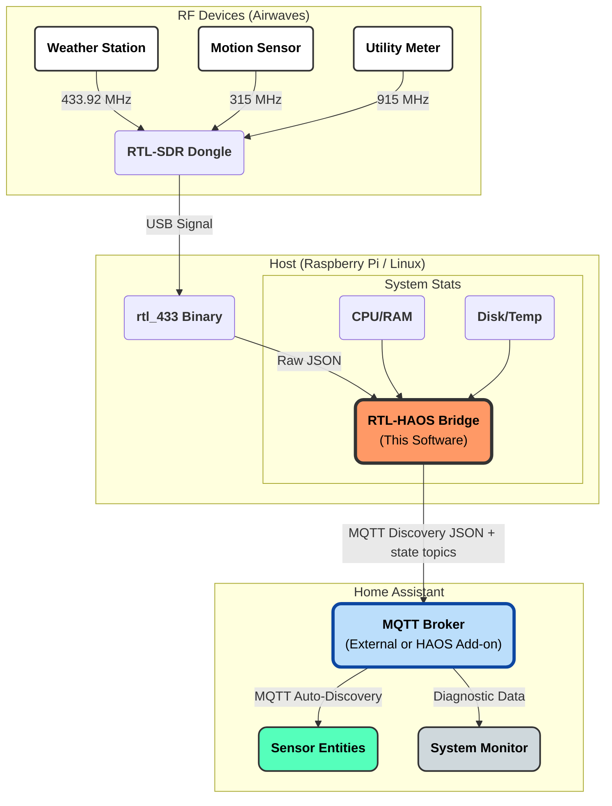

# RTL-HAOS: RTL-433 to Home Assistant Bridge


A "drop-in" bridge that turns one or more **RTL-SDR dongles** into Home Assistant-friendly sensors via MQTT.

Unlike standard `rtl_433` scripts, this project captures **detailed signal metrics** (RSSI, SNR, Noise) for every received packet, allowing you to troubleshoot interference and optimize antenna placement directly from Home Assistant.

It also functions as a **System Monitor**, reporting the host machine's health (CPU, RAM, Disk, Temp) and the live status of the radio dongle itself, giving you a complete view of your hardware's performance in one place.

See rtl_433 documentation for supported devices: https://github.com/merbanan/rtl_433

---

## ✨ Features

- **Auto Multi-Radio (plug-and-go):** If you leave `rtl_config` empty and the add-on detects multiple RTL-SDR dongles, it will automatically start **1–3** `rtl_433` instances (based on how many dongles you plug in).
  - **Zero-clutter UI:** the only auto-mode knob in the add-on UI is the **Region / Band Plan** dropdown: `rtl_auto_band_plan: auto|us|eu|world`.
  - **Sharing SDRs / reserving a dongle:** In auto mode, RTL-HAOS will use additional RTL-SDR dongles if they’re plugged in.
    If you need to keep a stick free for another add-on/app (ADS-B, another rtl_433 stack, etc.), switch to **manual mode** by defining `rtl_config` so RTL-HAOS only claims the dongle(s) you specify.
  - **Radio #1:** default 433.92 MHz (typical sensors)
  - **Radio #2:** region-aware high-band:
    - **EU/UK/EEA/CH:** 868 MHz
    - **US/CA/AU/NZ (and most others):** 915 MHz
    - If Home Assistant country is unknown, it will hop 868/915 on Radio #2
  - **Radio #3 (if present):** a regional hopper for “interesting” bands that **does not intentionally overlap** Radio 1/2.
  - Want full control of rates / hop intervals / exact freqs? Define `rtl_config` (manual mode) and you are responsible for the complete radio configuration.

- **Zero-Config Discovery:** Sensors appear automatically in Home Assistant (via MQTT Discovery) with correct units, icons, and friendly names.
- **Signal Diagnostics:** Reports **RSSI, SNR, and Noise Floor** for every device, making it easy to identify weak signals, plot coverage ranges, or hunt down interference sources.
- **Smart System Monitor:**
  - Reports Host CPU, RAM, Disk, and Temperature.
  - **Live Radio Status:** Shows `"Scanning..."`, `"Online"`, or error states like `"No Device Found"` / `"Error: USB Busy"` for each radio, grouped with the host device.
- **Native Graphing:** Environmental sensors use the correct `measurement` state class, and meter-like fields use `total_increasing`, so graphs and statistics in Home Assistant just work for temperatures, humidity, pressure, light, and utility counters.
- **Noise Reduction:**
  - **Data Averaging:** Buffers readings (e.g., every 30s) to prevent database bloat from sensors that spam updates every second.
  - **Filtering:** Built-in Whitelist and Blacklist support to ignore your neighbor's tire pressure sensors.
- **Advanced Data:**
  - **Dew Point:** Automatically calculated from Temp + Humidity sensors.
  - **Multi-Radio Support:** Run multiple dongles on different frequencies simultaneously.
  
> **Note (multi-dongle setups):** If you plug in multiple RTL-SDR dongles and leave `rtl_config: []`, RTL-HAOS will start multiple radios automatically.
> To force RTL-HAOS to use only one specific stick (and leave others for other software), define `rtl_config` (manual mode).

---


## 📚 Documentation

- **Configuration**: [docs/CONFIG.md](docs/CONFIG.md)
- **MQTT topics & discovery**: [docs/MQTT.md](docs/MQTT.md)
- **Multi-radio setup**: [docs/MULTI_RADIO.md](docs/MULTI_RADIO.md)
- **Development & testing**: [docs/DEVELOPMENT.md](docs/DEVELOPMENT.md)


## 🧩 How It Works



---
## 📸 Screenshots

### System Health & Entity View

| System Monitor | Entity View |
|---|---|
|  |  |

### Signal Diagnosis (SNR, RSSI, Noise)


_The signal boost between 8:00 AM and 5:00 PM is due to the AcuRite 5-in-1 internal supercapacitor charging via solar panel._

### Historical Efficacy Diagnosis


---

## 📂 Project Layout (high-level)

- `main.py` – Main entrypoint (starts radio manager(s), MQTT publishing, system monitoring).
- `rtl_manager.py` – Spawns/monitors `rtl_433` process(es) and handles multi-radio orchestration.
- `data_processor.py` – Handles buffering, averaging, and throttling.
- `mqtt_handler.py` – MQTT connection + Home Assistant MQTT Discovery publishing.
- `system_monitor.py` / `sensors_system.py` – Host stats + radio status publishing.
- `field_meta.py` – Field metadata (units, device class, icons, etc.).
- `utils.py` – Shared helpers (IDs, formatting, derived fields like dew point).
- `docs/` – Deeper documentation (config, MQTT, multi-radio, development/testing).
- `scripts/` – Developer helper scripts (test venv, fixture recording).
- `tests/` – Unit tests + opt-in integration/hardware tests.
- `docker-compose.yml` – Docker/Compose runtime.
- `repository.yaml` – Home Assistant add-on repository descriptor.


---

## 🛠️ Hardware Requirements

- **Host:** Raspberry Pi (3/4/5), Mini PC, Proxmox, or any Linux machine.
- **Radio:** RTL-SDR USB Dongle (RTL-SDR Blog V3, Nooelec, etc.).

---

## ⚙️ Configuration

Full configuration reference: **[docs/CONFIG.md](docs/CONFIG.md)**.

> **Note:** If you're using the **Home Assistant Add-on**, skip this section and go directly to [Installation](#-installation). Add-on configuration is done through the Home Assistant UI.

This section applies to **Docker** and **Native** installation methods only.

### Setup

```bash
git clone https://github.com/jaronmcd/rtl-haos.git
cd rtl-haos

# Copy and edit the environment file
cp .env.example .env
nano .env
```

All configuration is done via environment variables in a `.env` file.

### Required Configuration

At minimum, you need to configure your MQTT broker connection:

```bash
# --- MQTT ---
MQTT_HOST="192.168.1.100"
MQTT_USER=mqtt_user
MQTT_PASS=password
```

### Advanced Configuration

**Multi-Radio Setup:**

> **Note**: If you only have **one** RTL-SDR, no other radio configuration is needed.
> The bridge will automatically try to read the dongle's serial with `rtl_eeprom` and use that.
> If it cannot detect a serial, it falls back to device index `id = "0"`.

For multiple RTL-SDR dongles on different frequencies:

```bash
# Multiple radios 
RTL_CONFIG='[{"name": "Weather Radio", "id": "101", "freq": "433.92M", "rate": "250k"}, {"name": "Utility Meter", "id": "102", "freq": "915M", "rate": "250k"}]'
```

**Device Filtering:**

Block or allow specific device patterns:

```bash
# Device filtering (block specific devices)
DEVICE_BLACKLIST='["SimpliSafe*", "EezTire*"]'

# Device filtering (allow only specific devices - optional)
DEVICE_WHITELIST='["Acurite-5n1*", "AmbientWeather*"]'
```
**Misc Configuration:**
```bash
# Toggle "Last: HH:MM:SS" vs "Online" in status
RTL_SHOW_TIMESTAMPS=false
# Print rtl_433 JSON output
DEBUG_RAW_JSON=true
```
See [.env.example](.env.example) for all available configuration options.

---

## 🚀 Installation

### Option A: Home Assistant Add-on

The easiest way to use rtl-haos with Home Assistant OS is as an add-on.

#### 1. Add the Repository

In Home Assistant:

1. Navigate to **Settings** → **Add-ons** → **Add-on Store**
2. Click the **⋮** menu (top right) → **Repositories**
3. Add this repository URL:
   ```
   https://github.com/jaronmcd/rtl-haos
   ```
4. Click **Add**

#### 2. Install the Add-on

1. Find "RTL-HAOS" in the add-on store
2. Click on it and select **Install**
3. Wait for the installation to complete

#### 3. Configure the Add-on

Go to the **Configuration** tab and set your options:

**Basic Configuration:**

```yaml
# MQTT Settings
mqtt_host: ""          # Leave blank to auto-use the Home Assistant MQTT service (or set to core-mosquitto / broker IP)
mqtt_user: your_mqtt_user
mqtt_pass: your_mqtt_password

# Bridge identity (keeps your HA device stable)
bridge_id: "42"
bridge_name: "rtl-haos-bridge"
```

> **Note:** If `mqtt_host` is left blank, the add-on will try to use Home Assistant's Mosquitto service.

**Advanced Configuration (Optional, default values shown below):**

```yaml
# Publishing Settings
rtl_expire_after: 600 # Seconds before sensor marked unavailable
rtl_throttle_interval: 30 # Seconds to buffer/average data (0 = realtime)
debug_raw_json: false # Print raw rtl_433 JSON for debugging

# Battery alert behavior (battery_ok -> Battery Low binary_sensor)
# 0 clears immediately on next OK
battery_ok_clear_after: 300
# Note: Battery Low uses a long MQTT expire_after (24h+) to avoid going 'unavailable' for devices that report battery infrequently.

# Multi-Radio Configuration (leave empty for auto-detection)
rtl_config:
  - name: Weather Radio # Friendly name
    id: "101" # RTL-SDR serial number
    freq: 433.92M # Frequency
    rate: 250k # Sample rate (optional)
  - name: Utility Meter
    id: "102"
    freq: 915M
    rate: 250k
> Note: If `rtl_config` is empty, RTL-HAOS runs in “auto mode” and will attach to the first detected RTL-SDR only.
> Configure `rtl_config` to run multiple dongles.

# Device Filtering
device_blacklist: # Block specific device patterns
  - "SimpliSafe*"
  - "EezTire*"
device_whitelist: [] # If set, only allow these patterns
```

#### 4. Start the Add-on

1. Go to the **Info** tab
2. Enable **Start on boot** (recommended)
3. Click **Start**
4. Check the **Log** tab to verify it's running

---

### Option B: Docker

Once you have set up your configuration, you can run rtl-haos with Docker.

#### Run with Docker Compose

```bash
docker compose up -d
```

#### Or run with Docker directly

```bash
# Build the image
docker build -t rtl-haos .

# Run the container
docker run -d \
  --name rtl-haos \
  --restart unless-stopped \
  --privileged \
  --device /dev/bus/usb:/dev/bus/usb \
  --env-file .env \
  rtl-haos
```

> **Note:** The `--privileged` and `--device` flags are required for USB access to the RTL-SDR dongle.

#### View logs

```bash
docker compose logs -f
# or
docker logs -f rtl-haos
```

---

### Option C: Native Installation

#### 1. System Dependencies

Install Python and the `rtl_433` binary.

```bash
# Debian / Ubuntu / Raspberry Pi OS
sudo apt update
sudo apt install -y rtl-sdr rtl-433 git python3 python3-pip curl
```

#### 2. Install uv (Python package manager)

```bash
curl -LsSf https://astral.sh/uv/install.sh | sh
```

#### 3. Install Dependencies

```bash
# Update your Shell
source ~/.bashrc
# From the rtl-haos directory
uv sync
```

---

## ▶️ Usage

MQTT topic details: **`docs/MQTT.md`**.

### Home Assistant Add-on

Once the add-on is running, sensors will automatically appear in Home Assistant via MQTT Discovery. Check the add-on logs for status:

1. Navigate to **Settings** → **Add-ons** → **RTL-HAOS**
2. Click on the **Log** tab

### Docker

```bash
docker compose up -d
docker compose logs -f
```

### Native

```bash
cd rtl-haos
uv run python main.py
```

**Expected Output:**

```text
[STARTUP] Connecting to MQTT Broker at 192.168.1.100...
[MQTT] Connected Successfully.
[RTL] Manager started for Weather Radio. Monitoring...
 -> TX RaspberryPi (b827eb...) [radio_status_0]: Scanning...
 -> TX RaspberryPi (b827eb...) [radio_status_0]: Online
 -> TX Acurite-5n1 (1234) [temperature]: 72.3
```

> **Note:** It may take a few minutes for the system to receive its first radio transmission.

---


## 🧨 Maintenance: Cleanup & Radio Restart

RTL-HAOS exposes two maintenance buttons on the **Bridge** device to help with stale entities or a stuck radio process.

### 🧹 Delete Entities (Press 5x)

If you change batteries or remove devices, old entities may linger in Home Assistant. This cleanup tool clears the **MQTT Discovery configs** RTL-HAOS created.

1. Navigate to **Settings** → **Devices**
2. Open your Bridge device (named like `rtl-haos-bridge (xxxxxxxxxxxx)`)
3. Find the button **"Delete Entities (Press 5x)"**
4. Press it **5 times within 5 seconds**

What happens?
- RTL-HAOS scans retained Home Assistant discovery topics (`homeassistant/+/+/config`) for devices whose `manufacturer` contains `"rtl-haos"`.
- It publishes empty retained payloads to remove those discovery configs.
- Home Assistant removes the devices/entities almost immediately.
- Valid devices reappear automatically the next time they transmit data (discovery is republished on the next reading).

⚠️ Note: This scan matches on `manufacturer: rtl-haos`, so if you run **multiple RTL-HAOS bridges on the same broker**, it can remove discovery entries for *all* of them.

### 🔁 Restart Radios

If `rtl_433` gets wedged (USB hiccup, driver weirdness, no packets flowing), you can restart the radio processes without rebooting the host/add-on.

1. Navigate to **Settings** → **Devices** → your Bridge device
2. Press **"Restart Radios"**

What happens?
- RTL-HAOS terminates the running `rtl_433` process(es).
- The radio manager automatically re-launches them.
- The Radio Status entity will briefly show **"Rebooting..."**, then return to normal scanning/online behavior.

Notes:
- **Delete Entities** clears discovery/entities; it does *not* restart anything.
- **Restart Radios** restarts `rtl_433`; it does *not* restart Home Assistant or the container/add-on.


---

### 🪫 Battery Low (battery_ok)

If `rtl_433` reports a `battery_ok` field for a device, RTL-HAOS publishes a Home Assistant
**Battery Low** `binary_sensor`:

- `battery_ok = 0` → **Battery Low = ON** (LOW)
- `battery_ok = 1` → **Battery Low = OFF** (OK)

**Battery clear delay:** `battery_ok_clear_after` controls when LOW clears:

- `0` clears LOW immediately on the next OK report
- `>0` clears LOW only after `battery_ok` has remained OK for that many seconds (helps prevent flapping)

> Note: Many devices report battery infrequently. Battery Low uses a long MQTT `expire_after`
> (24h minimum) so it won’t quickly flip to “unavailable” just because no new `battery_ok`
> value was included in recent packets.

## 🔧 Advanced: Multi-Radio Setup

If you plan to run multiple RTL-SDR dongles (e.g. 433 MHz + 915 MHz), you **must** give each dongle a unique serial number and then configure `rtl_config` to pin each radio to its frequency.

See [docs/MULTI_RADIO.md](docs/MULTI_RADIO.md) for the full, step-by-step EEPROM/serial guide and `status_id` tips.

---

## 🤖 Running as a Service

To keep the bridge running 24/7 using the native installation method, use `systemd`.

1.  **Create the service file:**

    ```bash
    sudo nano /etc/systemd/system/rtl-bridge.service
    ```

2.  **Paste the configuration** (Update paths to match your username!):

    ```ini
      [Unit]
      Description=RTL-HAOS MQTT Bridge
      # Wait for the network to have a valid IP address before starting
      Wants=network-online.target
      After=network-online.target

      [Service]
      Type=simple
      # CHANGE THIS to your username (e.g., pi, user, admin)
      User=pi
      # CHANGE THIS to your directory path
      WorkingDirectory=/home/pi/rtl-haos

      # Unbuffer output so logs show up immediately
      Environment=PYTHONUNBUFFERED=1

      # Wait 10 seconds before starting to ensure USB device is ready
      ExecStartPre=/bin/sleep 10

      # CHANGE THESE PATHS to match your virtual environment and script location
      ExecStart=/home/pi/rtl-haos/.venv/bin/python3 /home/pi/rtl-haos/main.py

      # Restart automatically if it crashes
      Restart=on-failure
      RestartSec=5
      # Infinite restart attempts (do not stop trying)
      StartLimitIntervalSec=0

      [Install]
      WantedBy=multi-user.target
    ```

3.  **Enable and Start:**

    ```bash
      sudo systemctl daemon-reload
      sudo systemctl enable rtl-bridge.service
      sudo systemctl start rtl-bridge.service
    ```

4.  **Check Status:**
    ```bash
      systemctl status rtl-bridge.service
    ```

---


## ❓ Troubleshooting
- **"Service Fails to Start" (Exit Code Error)**
  - Check your username in the service file. If your terminal says user@hostname, your User= line must be user, not pi
  - Verify paths. Run ls /home/YOUR_USER/rtl-haos to make sure the folder exists.
  - Check the logs: journalctl -u rtl-bridge.service -b
- **"No Device Found" in Logs:**
  - The script cannot see your USB stick.
  - Run `lsusb` to verify it is plugged in.
  - Ensure you are not running another instance of `rtl_433` in the background.
  - The ExecStartPre=/bin/sleep 10 line in the service file usually fixes this by waiting for the USB to wake up on reboot.
  - Hard reset your Hardware or Virtual Machine.
- **"Kernel driver is active" Error:**
  - Linux loaded the default TV tuner driver. You need to blacklist it.
  - Run: `echo "blacklist dvb_usb_rtl28xxu" | sudo tee /etc/modprobe.d/blacklist-rtl.conf` and reboot.
- **Sensors updates are slow:**
  - Check `RTL_THROTTLE_INTERVAL`. Default is 30 seconds. Set to 0 for instant updates (not recommended for noisy environments).
- **Ghost Devices won't delete:**
  - Use **Delete Entities (Press 5x)** (see **Maintenance: Cleanup & Radio Restart** above).
  - If that still fails, use an MQTT explorer and delete the *retained* Home Assistant discovery topics created by RTL-HAOS:
    - `homeassistant/sensor/*/config`
    - `homeassistant/button/*/config`
    Look for discovery payloads where `device.manufacturer` is `"rtl-haos"`.
## 🧪 Development & Testing

See **`docs/DEVELOPMENT.md`**.
